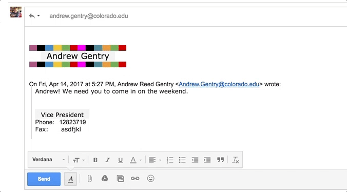

# NoTrim

[Download Here](https://chrome.google.com/webstore/detail/notrim/mdljgelepehfghjiifgibpkgdcdalfkn?)

### Reasoning:
I spent a bit of time making a gmail signature (way too much in fact) and became frustrated when I realized that Gmail will trim away your signature when it decides that your email is too cluttered. Personally, I like my emails to have my name on them. 

2 hours and 16oz. of coffee later, **NoTrim** was born. 

### What does it even do?
Heres what I'm talking about:

By simply adding NoTrim to your collection of chrome extensions, this annoying behavior goes right away. Automatically!

#### Shoutouts:
- Props to this [post](https://www.labnol.org/internet/gmail-trimming-signature/28762/) for providing a basis on the fix.
- Stack Overflow, **I love you.** 
